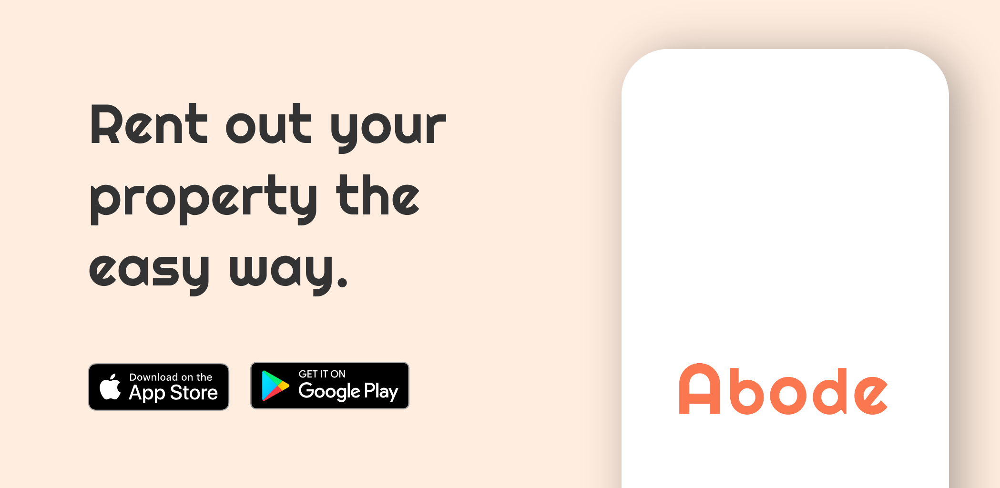

<h1 align="center">Abode for Landlords</h1> 

Abode Landlord matches you with the right tenants looking to rent a room or apartment like yours in a matter of days.
 

## Features ✨
- Post Listings.
- Accept or decline tenant request.
- View Listings.
- Instant Messaging.
- Track Payment.

## Architecture :gear:	

## Tech Stack 🔨
- React❤️Native
- TypeScript
- Ignite
- React Navigation
- Firebase
- Socket.io-client
- MobX State Tree
- React Hook Form
- Moti
- FlashList

## Screenshot 📸
  
  
   
   

## Download the app📱
- [App Store](https://apps.apple.com/app/abode-landlord/id1667660727)
- [Google Play](https://play.google.com/store/apps/details?id=com.app.abodelandlords) 
- [Check out Abode for tenant app](https://github.com/abumubarak-dev/Abode)
---

## Author
Built :hammer_and_wrench: with :heart: by Abu Mubarak
- [Twitter](https://twitter.com/abumubarakdev)
- [Linkedin](https://www.linkedin.com/in/abu-mubarak-035652182/)
- [Mail](https://mail.google.com/mail/u/0/?fs=1&to=abumubarak.dev@gmail.com&tf=cm)

