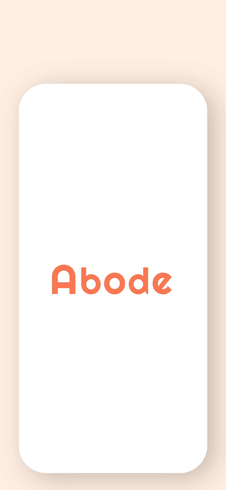
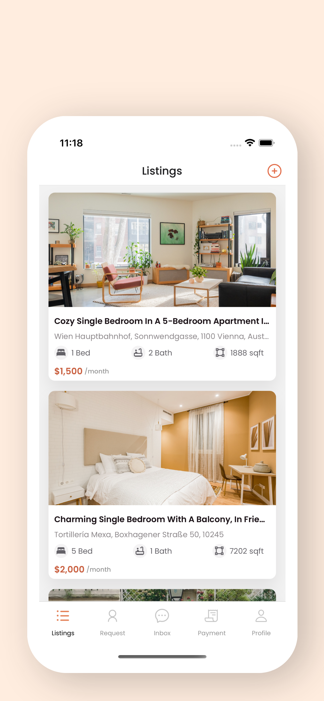
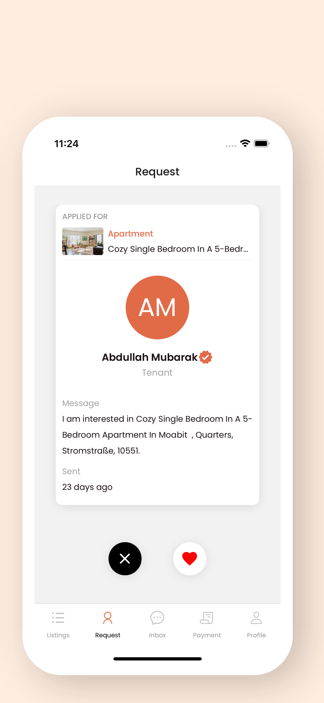

   

  <h1 align="center">Abode</h1>  

> Abode is a home rental platform that allows landlord to publish listings, and tenants can find and secure 
> their next home with ease.

## Tech Stack 🛠️

- React Native
- TypeScript
- React Navigation
- MobX State Tree
- React Hook Form
- Moti
- React Native Image Picker